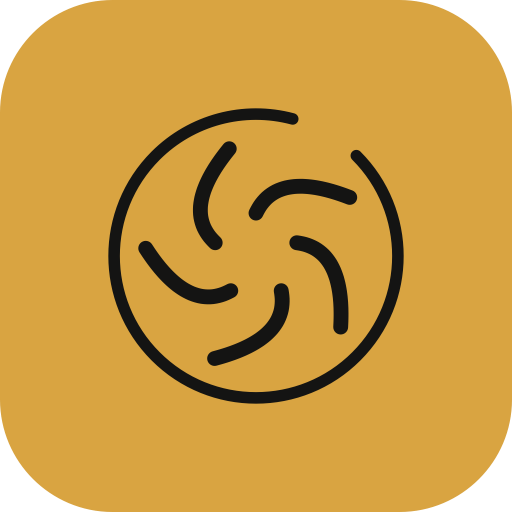
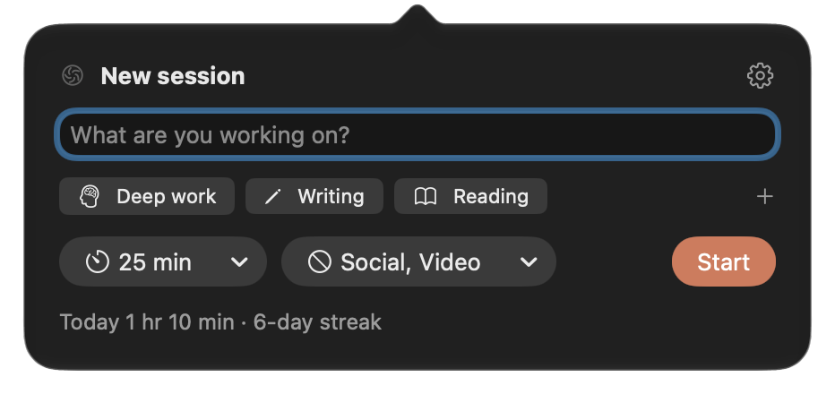
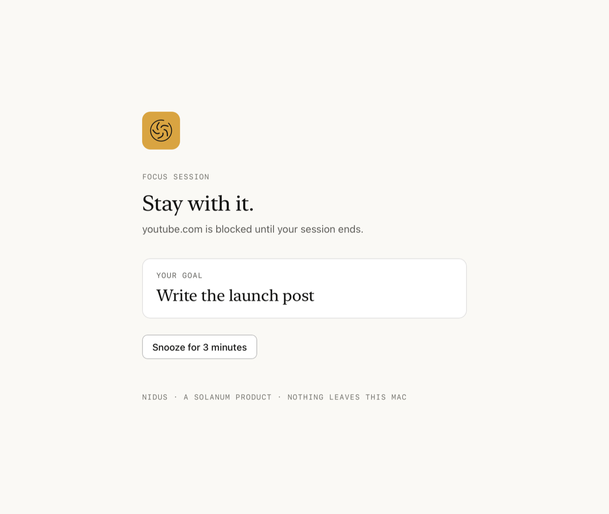
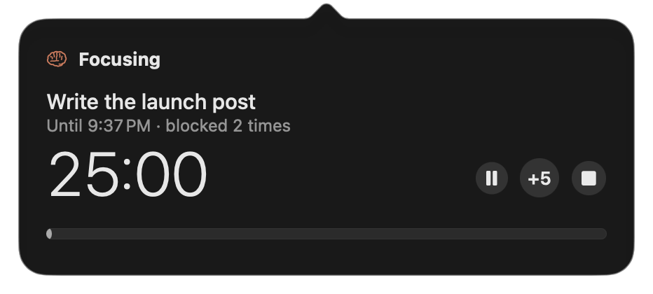
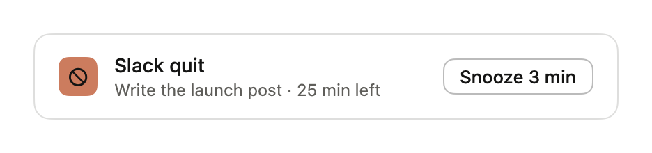
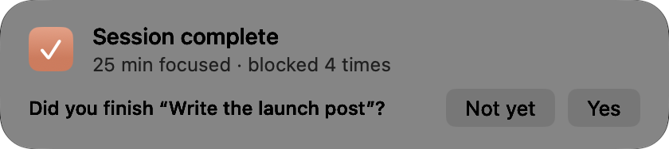
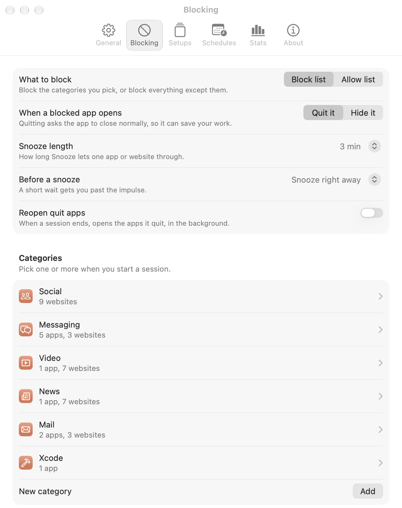
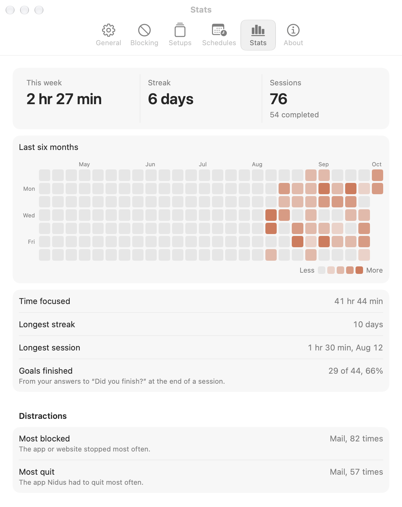

# Nidus

**Block the apps and websites that pull you away, for as long as you say.** A
Solanum product.



**Install in one line**: paste into Terminal (Apple silicon, macOS 27):

```sh
curl -fsSL https://raw.githubusercontent.com/samporter14/nidus/main/install.sh | zsh
```

Or [download Nidus.zip](https://github.com/samporter14/nidus/releases/latest/download/Nidus.zip); see [Install](#install).

A *nidus* is the place where something takes hold and grows.

## Why Nidus

- **Private.** Nidus collects nothing: no account, no analytics, no server.
  It never connects to the internet, and a test in this repository fails if
  its code ever reaches for the network. What it keeps stays on your
  Mac, and Settings can stop the history or clear it.
- **Light.** A menu bar app in Swift, with no Electron and no web views.
  Between sessions it does nothing at all, except keep one timer for the next
  schedule if you've made one. During a session it checks your apps and tabs
  once a second, at about 50 MB of memory and a fraction of a percent of one
  core.
- **Native.** SwiftUI, AppKit and Core Animation, with the Mac's own controls:
  a Liquid Glass popover and cards, and Settings in toolbar tabs like any
  Mac app's. It quits apps the way the Dock does, reaches browser tabs through Apple Events, and turns Focus modes
  on and off through Shortcuts. It follows Light and Dark mode, and Reduce
  Motion stills the menu bar glyph.

## What it does

Click the glyph in the menu bar, type what you're working on, pick a length
and the categories to block, and press Start. Until the session ends:

- **Blocked apps quit the moment they open.** They're asked to quit the normal
  way, so anything unsaved gets its usual prompt. Settings can hide them
  instead.
- **Blocked websites are replaced with a quiet page** in Safari, Google
  Chrome, Brave, Chromium and Opera Air, which reminds you what you're working
  on. When the session ends, or you quit Nidus, every tab goes back to where
  it was. A website
  can be a whole site (`youtube.com`, subdomains included) or just part of one
  (`youtube.com/shorts`, `reddit.com/r/all`). Firefox isn't supported: it
  offers no way to script its tabs.

  
- **The menu bar glyph keeps time.** At rest it is a virus particle; when a
  session starts it becomes a brain, and fills as the session runs. Settings
  can show the minutes beside it.
- **You stay in charge.** Pause or add five minutes from the popover or the
  right-click menu, and snooze one app or site for a few minutes from its card
  or the block page.
  Settings can make Snooze wait 10 or 30 seconds first, to get you past the
  impulse. Or turn on strict mode, which takes snooze and pause away, and asks
  you to type "stop early" to end a session before its time.

  
- **A card says what happened**, at the top of your screen: what was blocked,
  a snooze about to run out, and how the session went.

   
- **Any length.** Pick one, or type it: "40", "1h30", "until 3:30". With
  your permission, "Until next meeting" ends a session when your next calendar
  event starts.
- **Setups.** Save what you start often, like "Deep work: 90 minutes, only
  Xcode, strict", and start it in one click from the popover or the
  right-click menu.
- **Schedules.** "Weekdays, 9 to 12" starts a session on its own, with a card
  a minute before that lets you skip it or start now.
- **Breaks, Focus modes and apps to open.** Breaks can run between sessions,
  Pomodoro style. A session can open the apps you work in, and turn on Do Not
  Disturb or any other Focus mode, then off again at the end.
- **Stats.** Six months of focus as a graph, with your streaks, your longest
  session, how many goals you finished and what you blocked most. On Monday a
  card sums up last week. Export your history as CSV or JSON whenever you
  like. Categories for social media, messaging, video, news and mail are
  ready to use, and you can make your own.

 

## Start it from anywhere

**Shortcuts.** Nidus adds Start Focus, End Focus, Toggle Focus and Get Focus
Status to the Shortcuts app. For a keyboard shortcut, make a shortcut that
runs Toggle Focus (or opens `nidus://toggle`) and give it a key in its
details.

**Links.** Any app, script or launcher can open these:

| Link | Does |
| --- | --- |
| `nidus://start` | Starts a session with the popover's choices |
| `nidus://start?goal=Write&minutes=45&categories=social,video` | Starts one with these. Also `mode=allow`, `strict=1`, and `preset=Deep%20work` for a setup |
| `nidus://toggle` | Ends a session, or starts the last one again |
| `nidus://end` | Ends a session |
| `nidus://popover` | Opens the popover |

A strict session can't be ended by a link or a shortcut, only from the menu
bar, behind its phrase.

## Works with Bench

While a session runs, Nidus writes `focus.json` in its folder (whether a
focus session is on and until when, never your goal or what's blocked) and
says so on this Mac with the local notification `local.sam.nidus.focus`.
[Bench](https://github.com/samporter14/bench) uses it to hold "Finished"
cards until the session ends. Nothing leaves your Mac.

## Install

You need a Mac with Apple silicon (M1 or later) on macOS 27.

### Easiest: one line in Terminal

```sh
curl -fsSL https://raw.githubusercontent.com/samporter14/nidus/main/install.sh | zsh
```

It downloads the latest Nidus from this page's releases, puts it in
Applications (quitting and replacing an older one), and opens it. **Run the
same line again to update.** macOS doesn't show its "can't verify" warning for
apps installed this way, because it only flags apps downloaded through a web
browser. You're trusting this page instead, so [install.sh](install.sh) is
short enough to read first.

### Or download it

1. [Download Nidus.zip](https://github.com/samporter14/nidus/releases/latest/download/Nidus.zip)
   and open it.
2. Drag **Nidus** into your **Applications** folder, and open it from there.
3. The first time, macOS blocks it because it isn't from the App Store or a
   registered developer. Click **Done**, then go to **System Settings →
   Privacy & Security**, scroll down, and click **Open Anyway** next to Nidus.

### The first time

- Nidus lives in the menu bar; it has no Dock icon. Click the glyph to start,
  or right-click it for a short menu with Stats, Settings and Quit.
- It adds itself to your login items once, so a session carries on after a
  restart; macOS says so in a notification. Settings → General → Open at
  login turns that off.
- The first time a session reaches a browser, macOS asks whether Nidus may
  control it. Say OK, or websites in that browser won't be blocked. Settings
  → Blocking → Browsers shows where each one stands.
- "Until next meeting" asks for Calendar access the first time you choose
  it. Nidus reads your calendar on this Mac for the time of your next event,
  and nothing else.
- If you used Nidus as a droplet in Droppy, remove it there, so two copies
  don't block the same things twice.

## Uninstall

Quit Nidus (right-click the glyph, then Quit Nidus), delete it from
Applications, and delete `~/Library/Application Support/Nidus`, which holds
your session history.

## Build it yourself

With Xcode 27 installed:

```sh
Scripts/build-app.sh --open
```

That builds `build/Nidus.app`, ad-hoc signed. `swift test` runs the blocking
engine's tests. `Nidus --render-surfaces <folder>` draws the popover, the
cards and Settings to PNGs in both themes, off-screen, with a sample session
that blocks nothing.

## Credits

Made by [Sam](https://github.com/samporter14). Nidus began as a droplet for
[Droppy](https://getdroppy.app). MIT licensed; see [LICENSE](LICENSE).
